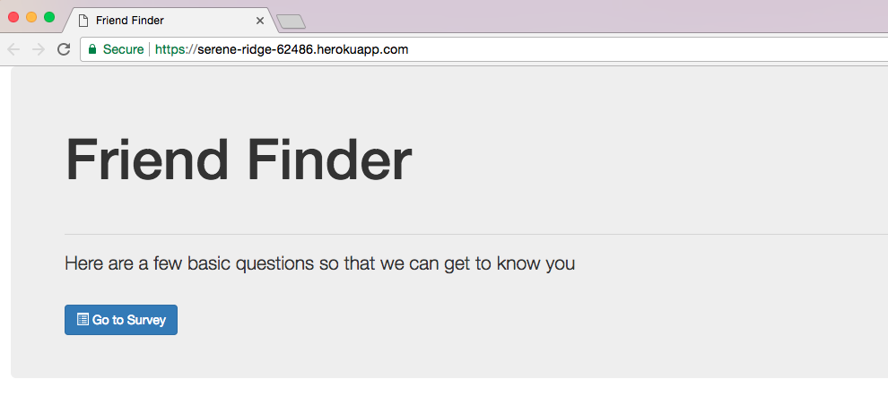
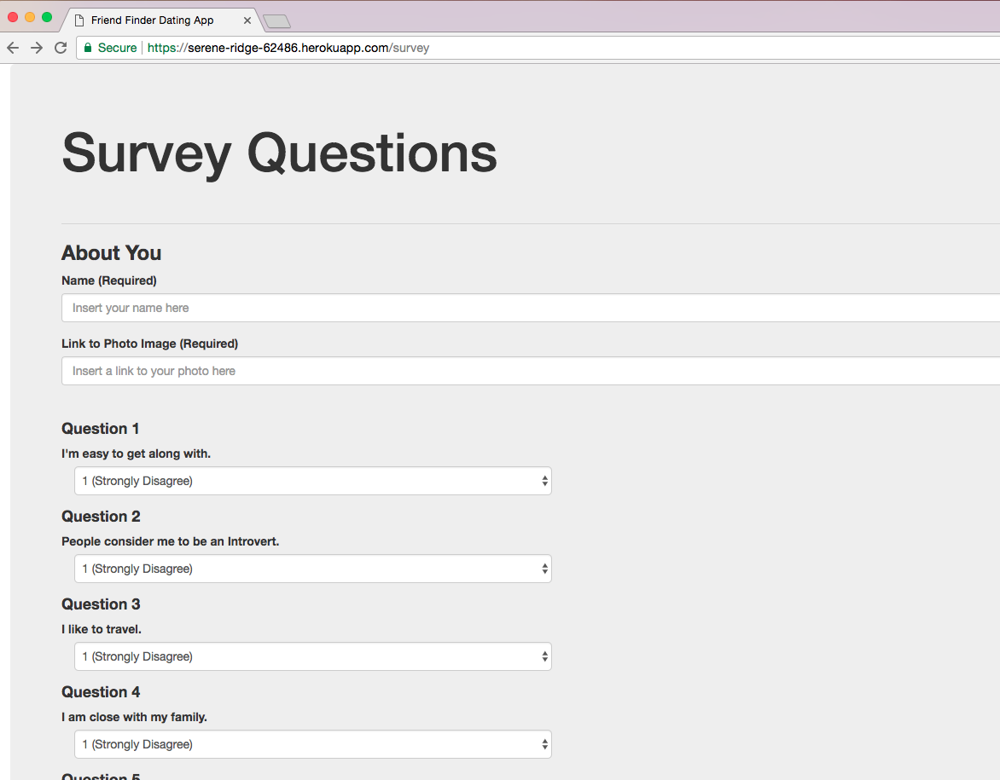
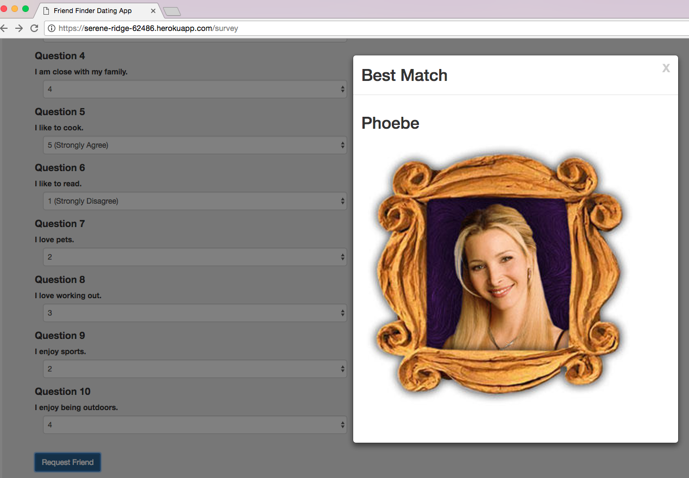
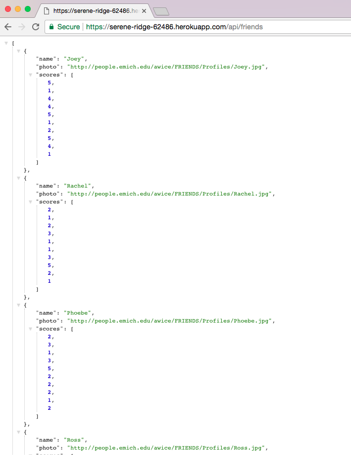

# FriendFinder

Friend Finder is a full stack application built using Node and Express Servers.  This application allows users to take a 10 question survey then suggests the best match based on the users' answers.

Built with:
* Express - used to handle routing for this application.
* Body Parser - used to parse request bodies.
* Path - provides utilities for working with file and directory paths.
* Module.exports - With this property, module is a variable that represents the current module and exports is an object that will be exposed as a module.
* Heroku - cloud platform used to deploy Friend Finder application.

Application landing page deployed using Heroku: https://serene-ridge-62486.herokuapp.com/

Sample Survey Page:

Sampling of results after completing user survey questions:

API page listing all friends:

